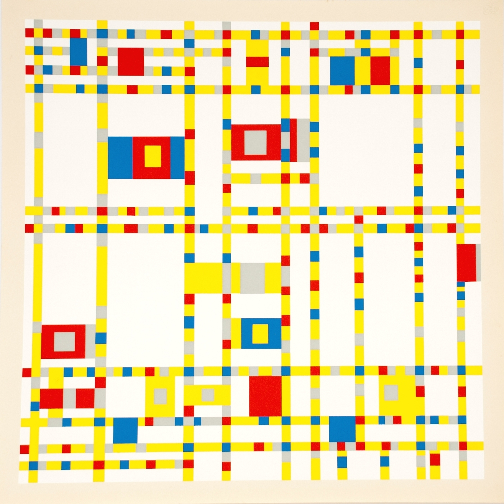
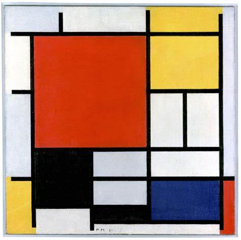
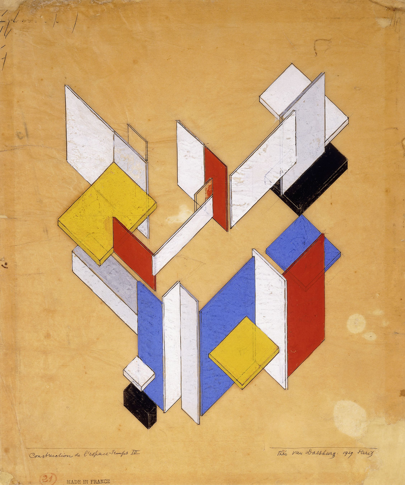
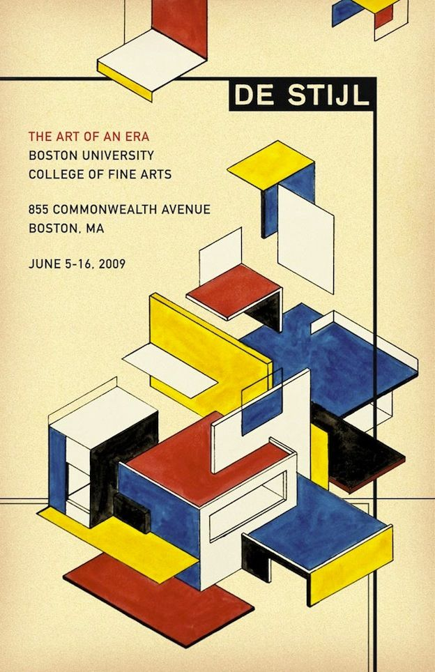
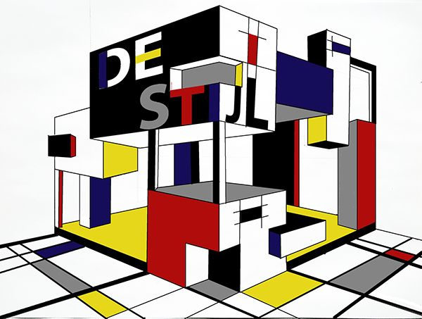
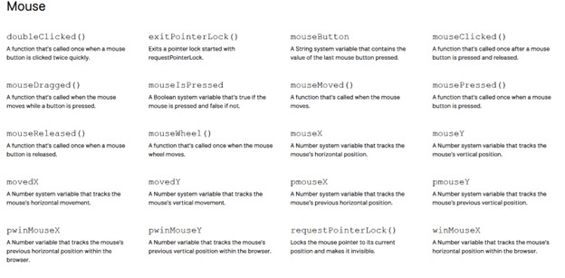
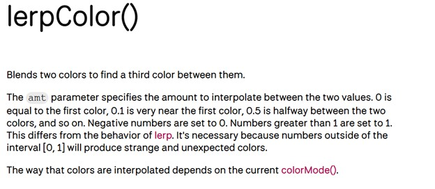
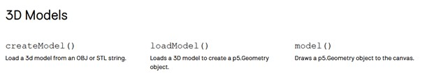

# ggha0155-week9

Hey, I am Ghazal, and this is my submission for Week 9.

# Part 1: Imaging Technique Inspiration

- De Stijl Movement and Mondrian’s Influence:

   - **De Stijl**, founded by Piet Mondrian and Theo van Doesburg, focuses on *geometric abstraction and grids*, using *primary colors* like red, blue, and yellow. These principles are evident in Mondrian’s "Broadway Boogie Woogie", with a structured grid and vibrant color blocks.
   - For my project, I will incorporate *De Stijl’s geometric grid structure and color palette* into a Pacman-style game, where the user can choose between different playgrounds inspired by various De Stijl artworks. The benefit of this approach is that it allows me to create diverse, visually engaging environments using basic shapes, while still maintaining a functional and interactive game.

- Technique Inspiration : 
    - De Style
    
- Visual aesthetic:
   - grid structure
   - primary colors
   - geometric patterns

## Visual References

To explore De Stijl visually, I’ve selected five images that demonstrate its balance, order, and harmony through minimalist design.

- **Piet Mondarian "Broadway Boogie Woogie"**

- **Piet Mondarian "composition no.2"**

- **Construction in space. (The distinction between the two-dimensionality of painting and the three-dimensionality of architecture)**

- **A poster from the Oston University**

- **An archituctur inspired from De Style**

# part 2: Coding Technique Exploration

 To implement user input in my Pacman-style game, I will use **p5.js** to capture mouse and keyboard inputs. The player can *click* on grid elements to change their color using mousePressed(), and use *keyboard keys* (like 'C' for color change) to toggle between different De Stijl-inspired color palettes and environments. Additionally, *lerpColor()* will enable smooth color transitions, reflecting Mondrian’s use of primary colors. This technique allows for dynamic interactivity, letting users engage with the grid layout and artwork environment, enhancing the game’s visual experience while staying true to De Stijl’s geometric abstraction.

#### screenshots of the codes I may need

- **Mouse and Keyboard**

- **lerpcolour**

- **3D**

## Related Refrences

1. [Snake game](https://p5js.org/examples/games-snake/)
2. [Pacman](https://pacmancode.com/)
5. [tranistion](https://stackoverflow.com/questions/58477636/transitioning-from-one-scene-to-the-next-with-p5-js)